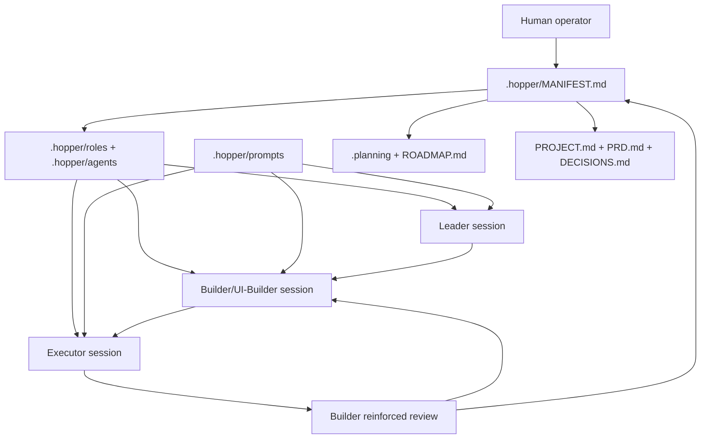
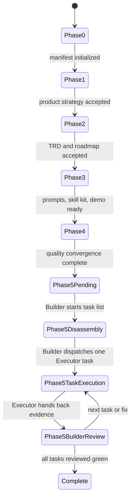

# TRD - LLM-Hopper v0.2

Anchor: `TRD.md::root`

## Background

Anchor: `TRD.md::background`

LLM-Hopper is implemented as a repository-resident protocol rather than a runtime service. The technical design relies on stable markdown artifacts, role prompts, and explicit handoff blocks. The human operator starts model sessions and copies handoffs; the repository remains the shared state layer.

## Architecture Overview

Anchor: `TRD.md::architecture-overview`



## Components

Anchor: `TRD.md::components`

| Component | Path | Responsibility |
| --- | --- | --- |
| Phase cursor | `.hopper/MANIFEST.md` | Current phase, authoritative files, next handoff. |
| Planning cursor | `.planning/STATE.md` | GSD-compatible state and progress. |
| Product layer | `PROJECT.md`, `PRD.md`, `DECISIONS.md` | Vision, requirements, risks, accepted decisions, routing policy. |
| Technical layer | `TRD.md`, `ROADMAP.md`, `.planning/` | Architecture, state machine, milestones, task plans. |
| Role registry | `.hopper/roles/ROLES.md`, `.hopper/agents/AGENTS.md` | Role permissions and local nickname-to-model mapping. |
| Prompt layer | `.hopper/prompts/` | Copyable entry points and handoff protocol. |
| Skill package | `.hopper/skill-package/` | Portable skill metadata and install helper. |
| Demo layer | `.hopper/demo/` | v0.2 Todo App role/TDD validation workflow. |

## Router Protocol

Anchor: `TRD.md::router-protocol`

The router is a written protocol:

1. Read `.hopper/MANIFEST.md`.
2. Read authoritative files named by the manifest.
3. Select the owning role from `.hopper/roles/ROLES.md`.
4. Select the local nickname from `.hopper/agents/AGENTS.md`.
5. Run the appropriate prompt entry point.
6. Write only artifacts allowed by the phase or task.
7. Emit the handoff block.
8. Run final sync only when the owning role has verified the phase or task.

## State Machine

Anchor: `TRD.md::state-machine`



Current repository state is Phase 4 complete and Phase 5 pending.

## Handoff Block Schema

Anchor: `TRD.md::handoff-block-schema`

```text
=== HANDOFF TO ROLE ===
Use role: [configured nickname]
Completed phase: [phase or task just completed]
Next phase: [phase or task to run next]
Authoritative files: [exact file list]

Sync Summary:
- Updated files: [...]
- Completed artifacts: [...]
- Verification evidence: [...]

=== TASK SPEC FOR NEXT ROLE ===
Role: [Leader | Builder | UI-Builder | Executor]
Files allowed to touch: [...]
Forbidden changes: [...]
RED: [...]
GREEN:
1. [...]
REFACTOR: [...]
Acceptance Criteria:
1. [...]

Prompt:
[minimal prompt that a fresh session can execute]
```

## Role Contracts

Anchor: `TRD.md::role-contracts`

| Role | Owns | Must Not Own |
| --- | --- | --- |
| Leader | Product framing, architecture direction, arbitration. | Blind low-level execution without review. |
| Builder | Task disassembly, implementation design, review, next dispatch. | Skipping TDD evidence or accepting scope creep. |
| UI-Builder | Builder responsibilities for UI/frontend work. | Backend or policy decisions outside assigned scope. |
| Executor | One bounded task with exact allowed files. | Product decisions, roadmap edits, manifest edits, next-task dispatch. |

## TDD Task Contract

Anchor: `TRD.md::tdd-task-contract`

Each Executor task must contain:

- Task ID and title.
- Files allowed to touch.
- Forbidden files and behaviors.
- RED condition proving the task starts incomplete.
- GREEN acceptance criteria.
- REFACTOR allowance constrained to touched files.
- Verification evidence required for Builder review.
- Handoff back to Builder.

## Verification Contract

Anchor: `TRD.md::verification-contract`

Builder review must verify:

1. RED, GREEN, and REFACTOR evidence is present.
2. Every acceptance criterion passes.
3. Only allowed files changed.
4. No state, roadmap, product, or role policy changed unless the Builder task explicitly allowed it.
5. The next handoff names exactly one owning role.

## Skill Template Convention

Anchor: `TRD.md::skill-template-convention`

Skill and prompt templates use lowercase kebab-case names:

- `hopper-status`
- `hopper-handoff`
- `hopper-execute`
- `hopper-review`
- `start-new-project-with-roles`
- `handoff-to-role`

Primary workflow entry points are `start-new-project-with-roles.md` and `handoff-to-role.md`.

## Todo Demo Contract

Anchor: `TRD.md::todo-demo-contract`

The Todo App demo validates v0.2 by exercising:

1. Leader kickoff while Phase 5 is pending.
2. Builder task disassembly into five TDD tasks.
3. Executor completion of exactly one scoped task.
4. Builder reinforced review before any next Executor task.

The helper script may print prompts only. App files are created only by prompted model sessions during the Phase 5 validation build.

## Data And State Files

Anchor: `TRD.md::data-and-state-files`

| File | State Type | Update Rule |
| --- | --- | --- |
| `.hopper/MANIFEST.md` | Phase cursor | Update at verified phase boundaries. |
| `.planning/STATE.md` | Planning cursor | Update at verified phase boundaries. |
| `ROADMAP.md` | Milestone status | Update when plan status changes. |
| `.planning/phases/*/TASK-LIST.md` | Task state | Builder owns task status updates. |
| `.hopper/costs/COST-LOG.md` | Cost records | User or cost prompt appends entries. |

## Non-Goals

Anchor: `TRD.md::non-goals`

- No background worker.
- No API orchestration.
- No model-provider lock-in.
- No hidden state outside Git-tracked files.
- No automatic proof that a model followed instructions without review evidence.

## Operational Risks

Anchor: `TRD.md::operational-risks`

| Risk | Technical Control |
| --- | --- |
| Prompt sprawl | Keep two primary entry points and mark legacy prompts as compatibility wrappers or remove them. |
| State drift | Require final sync after verified phase/task completion. |
| Model-specific docs rot | Keep role routing separate from local model mapping. |
| Executor scope creep | Enforce allowed files, forbidden files, and Builder review. |
| Cold-start failure | Manifest must name authoritative files and next prompt. |

**Current version:** v0.2
